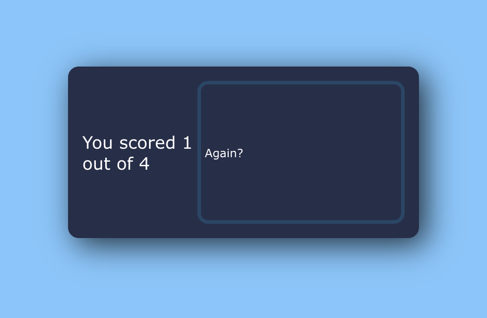

# 💬Quiz app

This webapp was built with ReactJs. It is a simple multiple choice quiz, where users must answer a total of seven questions. After they finish answering, they can see their total score.

## Table of contents

  - [Screenshot](#screenshot)
  - [Links](#links)
- [My process](#my-process)
<!-- - [Author](#author) -->

### 📷Screenshot

- Desktop: 

- Mobile: 

### 📌Links

- Live Site URL: [Live site url](https://comment-forum-330c8.web.app/)

## 📈My process
First I created an array of questions, which contained four options and a property that indicated whether the answer was correct or not. Then I created three states, currentQuestion, score and showScore. Everytime an answer is chosen, the the currentQuestion state gets added 1. In case the answer is correct, one point is added to the score. This is then displayed once the current question value equals the total amount of questions.
<!-- ### 💁🏽‍♀️Author -->

<!-- - Website - [Maria Peña](https://www.your-site.com) -->

